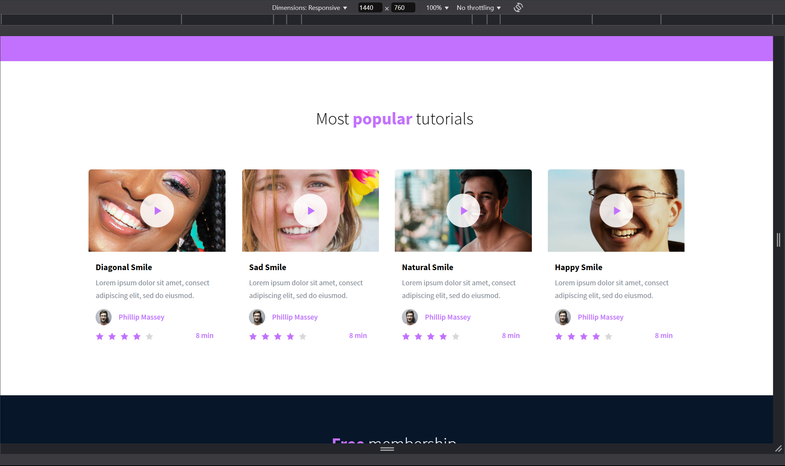
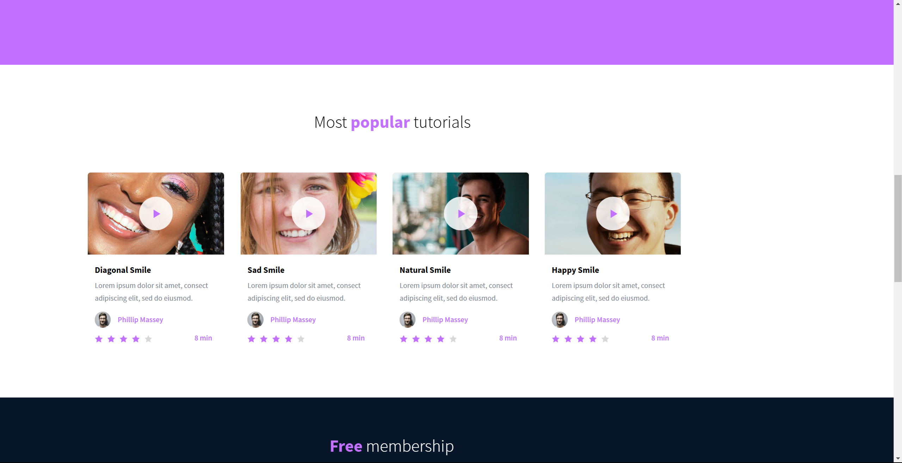

# CSS Advanced

This and future projects are implementing, from scratch, a webpage from a
designer file. The last project was the HTML only. This project is the CSS.

The designer file is available on Figma [here](https://www.figma.com/file/XrEAsu1vQj5fhVaNG38d2W/Homepage).

This is what this project is replicating exactly, but just the HTML and CSS,
continuing from the last project, which replicated just the HTML.

Visit the website [here](https://zytronium.github.io/atlas-web-development/css_advanced/).

Note: This website is designed to exactly match the Figma file **at the same
display width**, which is 1440px. If you do not have the device width set to
this, some things **will** look off.

This is how it should look at 1440px width:

And this is how it would look at my monitor's resolution, 2560x1440px:

---

### Tasks checklist:
[//]: # ("​" comes before every number because otherwise, the
numbers will be formatted like "i, ii, iii, iv, etc." instead
of "1, 2, 3, 4, etc.". "​" is a zero-width space)
- [X] ​0. README and objectives!
- [X] ​1. Import the style
- [X] ​2. Header and Banner
- [X] ​3. Quotes
- [X] ​4. Videos list
- [ ] ​5. Membership
- [ ] ​6. FAQ
- [ ] ​7. Footer
- [X] ​8. Make it Live!

- [ ] **Everything Done ✓**
